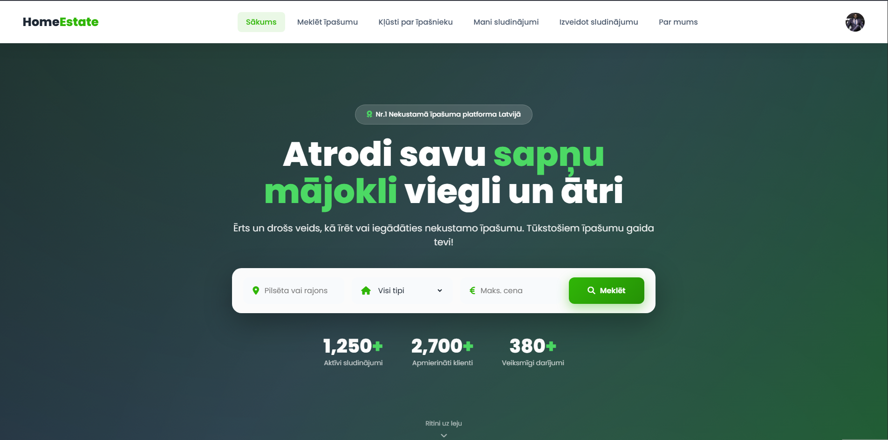
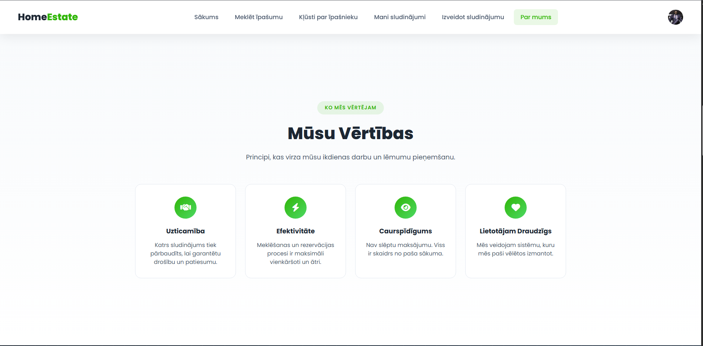
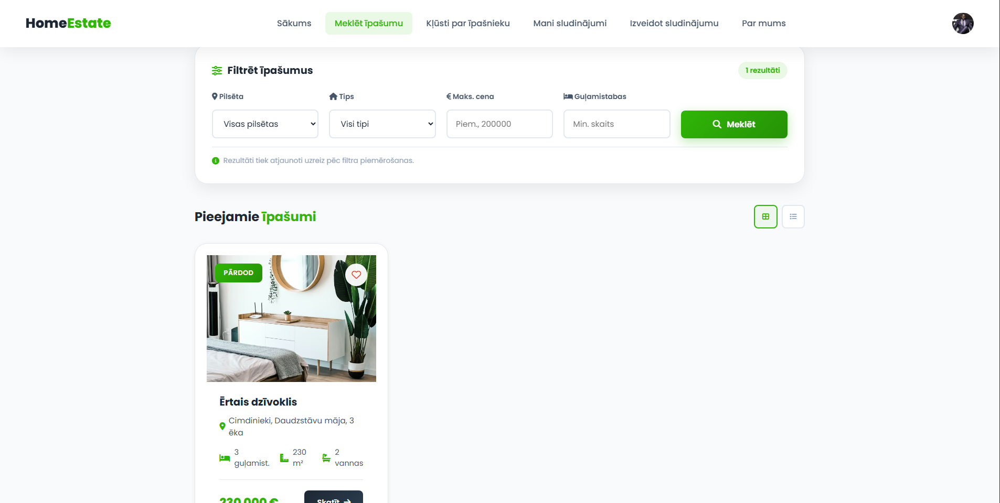
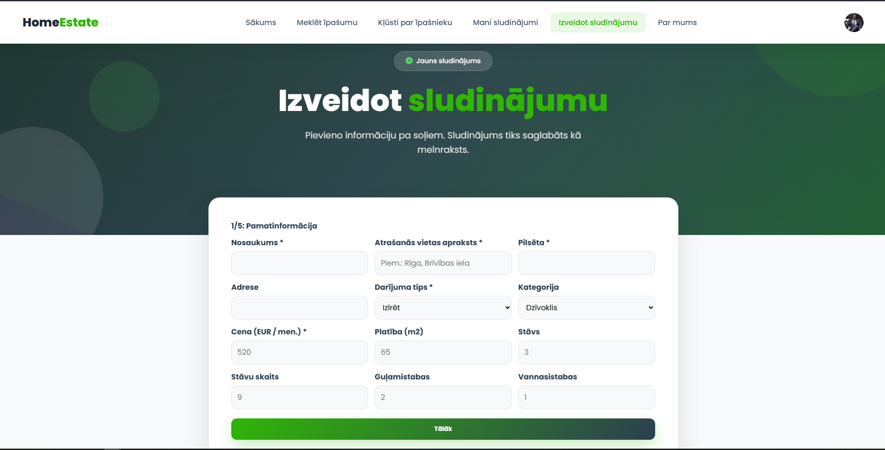
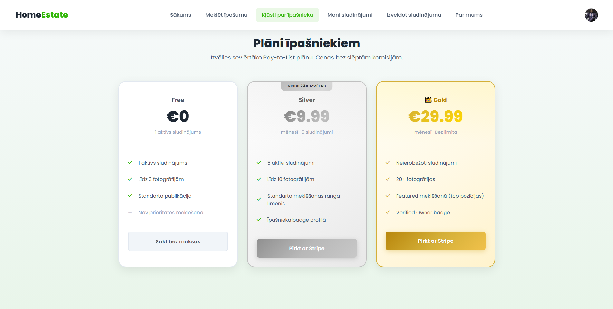
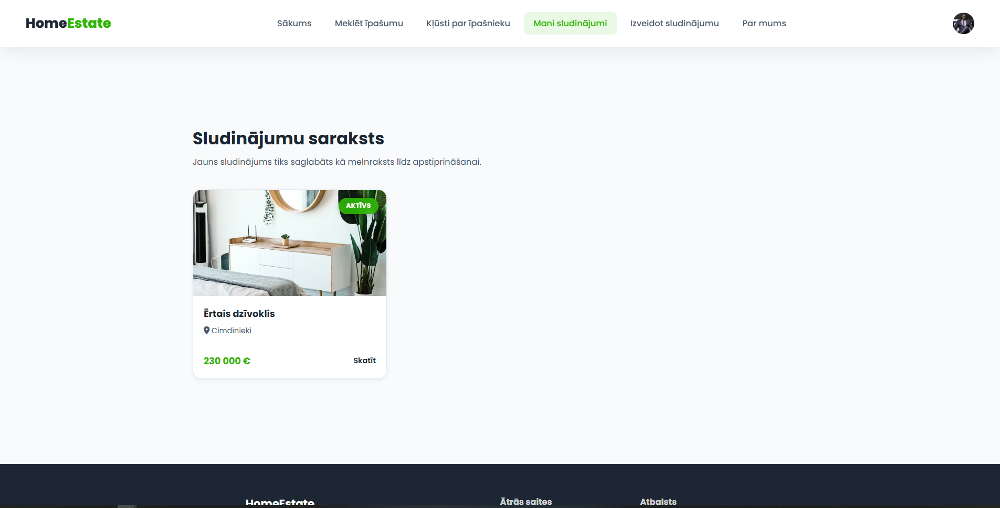
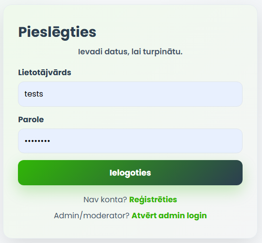
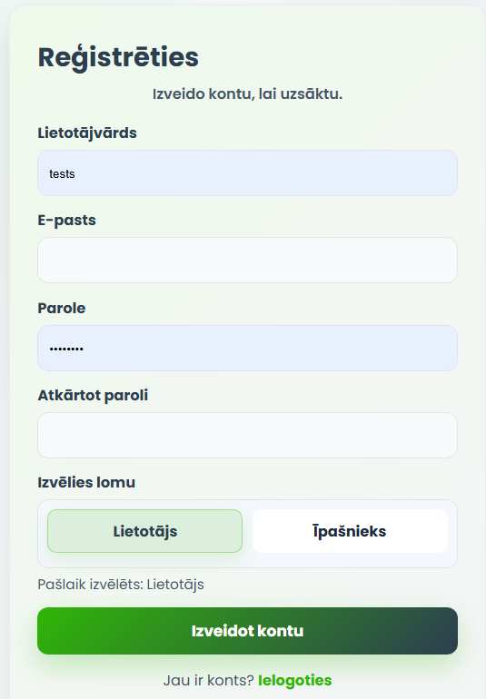
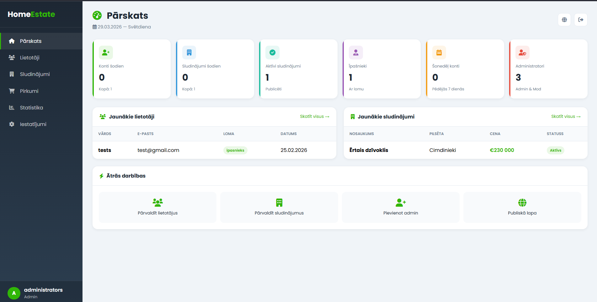
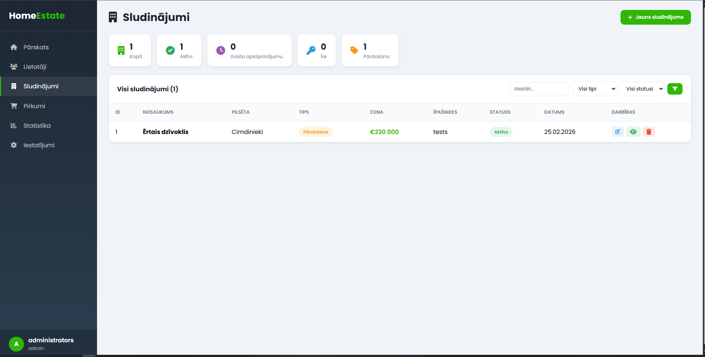

# HomeEstate - Nekustamo īpašumu platforma

HomeEstate ir moderna un droša nekustamo īpašumu platforma Latvijā, kas izstrādāta, lai vienkāršotu īpašumu īrēšanas un pirkšanas procesu. Vietnei ir skaists un atsaucīgs lietotāja interfeiss (UI), uzlabota meklēšanas sistēma un īpašs īpašnieku panelis sludinājumu pārvaldībai ar Stripe maksājumu integrāciju premium plāniem.

**Apmeklējiet vietni:** [http://homeest.unaux.com/](http://homeest.unaux.com/)

---

## Lietošanas ceļvedis

###  Īpašnieka ceļš - no reģistrācijas līdz darījumam

**Mērķis: publicēt sludinājumu un atrast īrnieku vai pircēju**

1. Atveriet vietni un navigācijas joslā nospiediet **Reģistrēties**
2. Aizpildiet reģistrācijas formu - izvēlieties lomu **Īpašnieks**
3. Piesakieties sistēmā ar savu lietotājvārdu un paroli
4. Navigācijā nospiediet **Kļūsti par īpašnieku** un izvēlieties plānu:
    - **Bezmaksas** - 1 sludinājums, 3 attēli
    - **Sudraba** - 9.99€/mēn., 5 sludinājumi, 10 attēli, verificētā nozīmīte
    - **Zelta** - 29.99€/mēn., neierobežoti sludinājumi, 50 attēli, verificētā nozīmīte
5. Maksas plānam aizpildiet maksājumu caur **Stripe** (testa karte: `4242 4242 4242 4242`)
6. Navigācijā nospiediet **Izveidot sludinājumu** un aizpildiet formu:
    - Nosaukums, pilsēta, adrese, darījuma tips, kategorija
    - Cena, platība, stāvs, guļamistabas, vannasistabas
    - Apraksts, plānojums, ērtības
    - Augšupielādējiet galveno attēlu un galeriju
7. Saglabājiet - sludinājums nonāk statusā **Melnraksts** līdz moderatora apstiprinājumam
8. Pēc apstiprināšanas sludinājums ir publiski redzams
9. Sadaļā **Mani sludinājumi** -> nospiediet statistikas ikonu -> skatiet saņemtos pieteikumus
10. Nospiediet **Pieņemt** vai **Noraidīt** pie katra pieteikuma
11.  **Rezultāts:** pieņemot pieteikumu - pārdošanas vai ilgtermiņa īres gadījumā sludinājums iegūst statusu **Pārdots**; īstermiņa īres gadījumā rezervētie datumi tiek atzīmēti kalendārā

---

###  Interesentu ceļš - no meklēšanas līdz darījumam

**Mērķis: atrast un rezervēt vai iegādāties īpašumu**

1. Atveriet vietni - bez reģistrācijas var pārlūkot sludinājumus
2. Sākumlapā izmantojiet meklēšanas bloku: ievadiet pilsētu, izvēlieties darījuma tipu un kategoriju -> nospiediet **Meklēt**
3. Sludinājumu sarakstā izmantojiet filtrus (cena, guļamistabas, platība, "Tikai pārbaudīti īpašnieki")
4. Nospiediet **Skatīt** pie interesējoša sludinājuma
5. Iepazīstieties ar pilnu informāciju: aprakstu, galeriju, ērtībām, adresi un īpašnieka informāciju
6. Lai iesniegtu pieteikumu - nospiediet **Reģistrēties** un izveidojiet kontu ar lomu **Lietotājs**
7. Atgriezieties pie sludinājuma un nospiediet **Izveidot pieteikumu**:
    - **Īstermiņa īre** - izvēlieties sākuma un beigu datumu
    - **Ilgtermiņa īre** - norādiet plānoto periodu mēnešos un sākuma datumu
    - **Pārdošana** - ievadiet piedāvāto summu un finansēšanas veidu
8. Nospiediet **Nosūtīt pieteikumu** -> parādās paziņojums "Pieteikums veiksmīgi nosūtīts."
9. Sadaļā **Mani pieteikumi** sekojiet pieteikuma statusam: Gaida apstiprinājumu / Apstiprināts / Noraidīts
10. Kamēr gaidāt - var sazināties ar īpašnieku tieši caur **Čatu** (čata ikona sludinājuma lapā)
11.  **Rezultāts:** pēc īpašnieka apstiprinājuma darījums ir redzams sadaļā **Darījumu vēsture**

---

###Papildu funkcijas

| Funkcija | Kā piekļūt                                                          |
|---|---------------------------------------------------------------------|
| Favorīti | Nospiest sirds ikonu pie sludinājuma -> profila izvēlne -> Favorīti |
| Čats | Sludinājuma lapa -> čata ikona -> rakstīt īpašniekam                |
| Profila iestatījumi | Profila ikona -> Iestatījumi                                        |
| Palīdzības centrs | Vietnes kājene -> Palīdzība -> aizpildīt formu                      |
| Adminu panelis | Vietnes kājene -> Administrācija (tikai admin/moderatoriem)         |

---

### **Sākumlapa**

Sākumlapa kalpo kā galvenais ieejas punkts lietotājiem. Tajā ir moderna "hero" sadaļa ar ātru meklēšanas joslu pēc pilsētas, veida un cenu diapazona. Tā arī parāda jaunākos aktīvos sludinājumus tieši no datubāzes, kopā ar platformas statistiku.

---

### **Par Mums**

Lapa "Par Mums" skaidro HomeEstate misiju un vīziju. Tajā izmantotas interaktīvas animācijas un dekoratīvas formas, lai pastāstītu platformas stāstu, uzsverot mērķi padarīt Latvijas nekustamo īpašumu tirgu caurskatāmāku un pieejamāku.

---

### **Meklēt īpašumu**

Šī sadaļa ļauj lietotājiem pārlūkot visus aktīvos sludinājumus. Tā ietver visaptverošu filtrēšanas sistēmu, lai atrastu īpašumus pēc atrašanās vietas, veida (pirkt/īrēt), cenu diapazona un kategorijas (dzīvoklis, māja, zeme). Rezultāti tiek parādīti modernā tīkla izkārtojumā ar informatīvām kartītēm.

---

### **Izveidot Sludinājumu**

Īpaša vairāku soļu forma īpašniekiem jaunu sludinājumu izveidei. Šī funkcijām bagātā saskarne vada lietotājus caur pamatinformācijas ievadi, aprakstiem, ērtībām un augstas kvalitātes attēlu augšupielādi. Tā ietver reāllaika validāciju, lai nodrošinātu pilnīgus un precīzus datus.

---

### **Kļūsti par īpašnieku**

Šī lapa uzsver "Pay-to-List" modeļa priekšrocības. Tajā skaidroti dažādi abonēšanas plāni (Silver un Gold), kas pieejami īpašniekiem. Integrācija ar Stripe nodrošina drošus un vienkāršus maksājumus, ļaujot iegūt lielāku redzamību saviem īpašumiem.

---

### **Mani Sludinājumi**

Īpašnieka personīgais panelis, kurā var pārvaldīt visus savus sludinājumus. Tas nodrošina skaidru pārskatu par aktīvajiem, melnrakstu un beigušos termiņu sludinājumiem, ļaujot veikt ātru rediģēšanu, dzēšanu vai melnrakstu publicēšanu.

---

### **Pierakstīšanās**

Droša un lietotājam draudzīga pieteikšanās lapa. Tā nodrošina piekļuvi gan parastajiem lietotājiem, gan īpašniekiem, nodrošinot personalizētu pieredzi visā platformā, vienlaikus aizsargājot lietotāju datus.

---

### **Reģistrēties**

Reģistrācijas lapa, kurā jauni lietotāji var pievienoties platformai. Tā ļauj lietotājiem izvēlēties savu lomu (Lietotājs vai Īpašnieks) reģistrācijas laikā, kas dinamiski maina pieejamās funkcijas pēc konta izveides.

---

### **Administrācijas Panelis**

Spēcīgs administratīvais panelis vietnes moderatoriem un administratoriem. Tas ļauj pilnībā pārvaldīt lietotājus, sludinājumus un platformas iestatījumus, nodrošinot HomeEstate satura kvalitāti un drošību.

---

### **Datu Tabula**

Detalizēts datu pārvaldības skats administratora panelī. Tas nodrošina tabulveida saskarni uzlabotai filtrēšanai, kārtošanai un platformas datubāzes lielapjoma pārvaldībai, ieskaitot lietotāju lomas un sludinājumu statusus.
